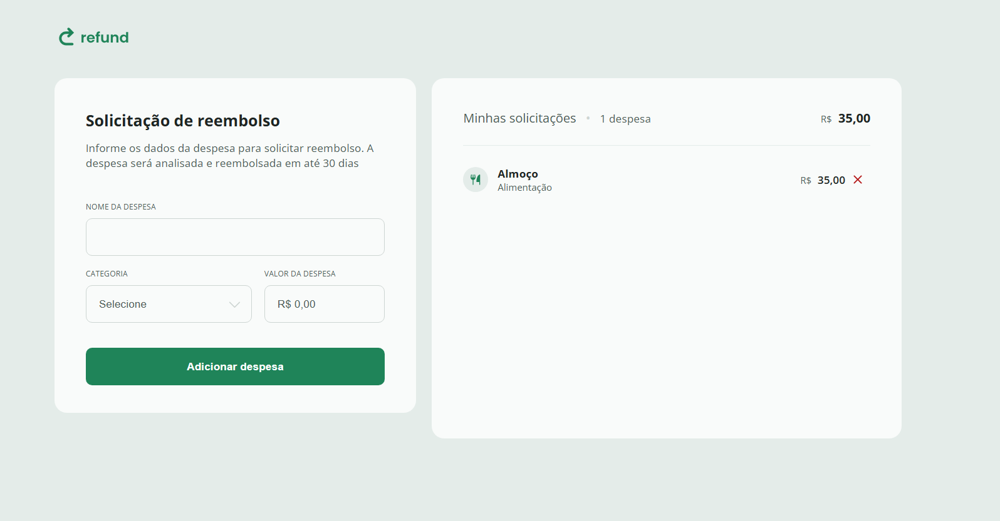

# Refund

Refund é uma aplicação web para gerenciamento de solicitações de reembolso. Os usuários podem adicionar despesas informando o nome, a categoria e o valor, e a aplicação calcula automaticamente o total de despesas. O objetivo é facilitar o controle de reembolsos de forma simples e intuitiva.

# Funcionalidades

- Adicionar novas despesas com nome, categoria e valor

- Listagem de todas as despesas adicionadas

- Cálculo automático do total de despesas

- Remoção de despesas da lista

- Formatação do valor monetário no padrão brasileiro (R$)

# Captura de Tela

# Tecnologias Utilizadas

- HTML, CSS e JavaScript puro (Vanilla JS)

- Manipulação do DOM para interatividade

- Formatação de moeda com toLocaleString("pt-BR")
